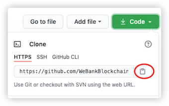
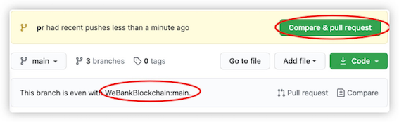
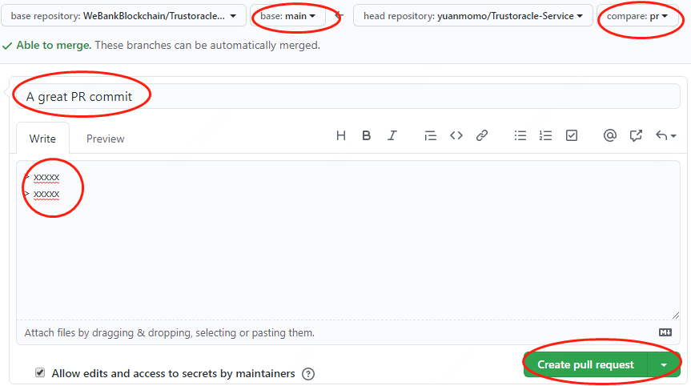

# Truora 贡献指南

欢迎，提前感谢你的帮助和支持！

如果你是第一次贡献，只需按照以下简单步骤操作即可。我们将以修改为 Truora-Service 例子给你介绍。

如果你的电脑上尚未安装 `git`, 请按照这个[ 安装指引 ](https://help.github.com/articles/set-up-git/)进行安装。

## Fork本代码仓库


点击图示中的按钮去 Fork 这个代码仓库。
这个操作会将代码仓库复制到你的账户名下。

## Clone代码仓库



接下来，将复制后的代码仓库克隆到你的电脑上。点击图示中的绿色按钮，接着点击复制到剪切板按钮（将代码仓库地址复制下来）

随后打开命令行窗口，敲入如下 `git` 命令：

```
git clone https://github.com/{WeBankBlockchain}/Truora-Service.git
```
替换大括号为自己的账号，将 fork 后的仓库 Truora-Service 克隆到你的本地电脑上。

## 代码修改
```
cd Truora-Service

vim XXX
```

## Commit修改

```Bash
git commit -m "A great commit"
```

## 将改动 Push 到 GitHub

使用 `git push` 命令发布代码，替换大括号中 `dev` 为自己的分支。

```Bash
git push origin {dev}
```


## 提出 Pull Request 将你的修改供他人审阅

前往 Github 你的代码仓库，你会看到一个 `Compare & pull request` 的按钮，点击该按钮。



选择自己的分支，填写 PR 的标题和明细，接着再点击 `Create pull request` 按钮，正式提交 pull request。





提交的改动经过审核，会合入到仓库。合并后，你会收到电子邮件通知。
