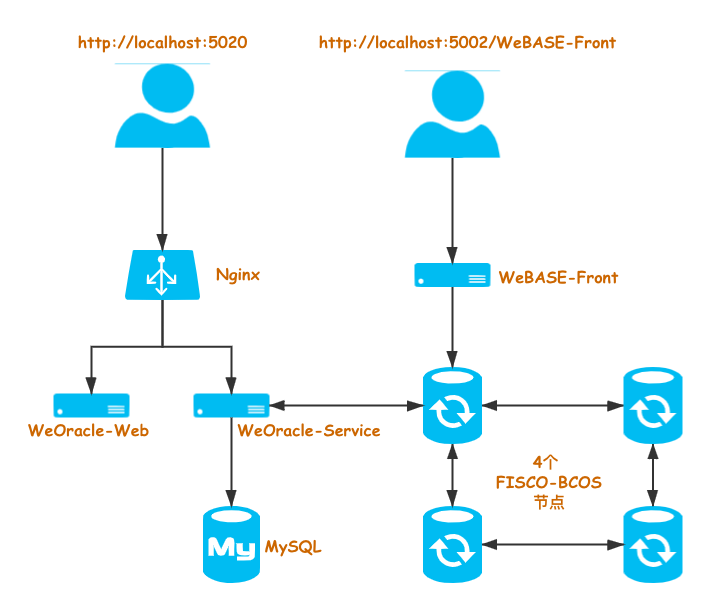

# 一键部署


```eval_rst
   .. important::
   
		- 使用一键部署 TrustOracle 服务时，**仅支持 Linux 操作系统！！**
```

## 部署介绍
一键部署是基于 `Docker`，`Docker-Compose` 和 `Bash Shell` 封装的一个部署工具，提供一键部署整个 TrustOracle 服务，包括依赖的 FISCO-BCOS 节点和 MySQL 数据库等。

适合以下场景：

* 快速体验 TrustOracle 服务
* Oracle 服务的开发和调试

使用一键部署工具，部署 TrustOracle 服务时，会同时部署一个 WeBASE-Front（Solidity 合约的开发和调试环境）服务，作为 Oracle 合约的开发和调试环境。

部署后的架构如下：




* **WeBASE-Front**

    WeBASE-Front 是 WeBASE 中间件的一个子系统服务，针对 FISCO-BCOS 区块链服务提供 Solidity 合约的可视化开发，编译，部署和调试功能。
    
    在进行 TrustOracle 相关业务的合约开发和调试时，可以使用 WeBASE-Front 中的合约 IDE，方便合约的开发和调试，提高开发效率。

    关于 WeBASE-Front，请参考：[WeBASE-Front](https://webasedoc.readthedocs.io/zh_CN/latest/docs/WeBASE-Front/README.html) 
* **TrustOracle-Web**
    
    TrustOracle-Web 是 TrustOracle 服务的前端 Web，主要包含以下几个功能：
    * 分页查询 Oracle 请求历史记录
    * 单个查询 Oracle 请求明细（状态，响应结果，错误信息等）
    * TrustOracle-Service 内置合约地址查询
    * 查询所有 TrustOracle-Service 服务列表

    关于 TrustOracle-Web，请参考：[TrustOracle-Web](../TrustOracle-Web/outline.md) 
* **TrustOracle-Service**

    TrustOracle-Service 是 TrustOracle 的服务端：
    * 监听 FISCO-BCOS 链上 TrustOracle 合约的事件
    * 接收链上事件，调用 Http API 接口或 VRF 随机数生成库，获取结果
    * 结果上链，供用户合约查询
    
    关于 TrustOracle 原理，请参考：[TrustOracle-Service](../TrustOracle-Service/outline.md) 


## 前置要求
### 系统要求

| 操作系统         |  版本最低要求     |  
| ------------- |:-------|
| CentOS/RHEL |7.3（kernel >= 3.10.0-514）|
|Debian|Stretch 9  |
|Ubuntu|Xenial 16.04 (LTS)|


### 硬件配置

| 配置 | 最低配置 | 推荐配置 |
| ---- | -------- | -------- |
| CPU  | 1.5 GHz   | 2.4 GHz   |
| 内存 | 4 GB      | 8 GB      |
| 核心 | 2 核      | 4 核      |
| 带宽 | 1 Mb      | 10 Mb     |

## 脚本说明
TrustOracle 一键部署工具特性：

* 提供自动安装依赖服务功能，包括：`OpenSSL`, `curl`, `wget`, `Docker`, `Docker Compose` 等
* 调用 FISCO-BCOS 一键部署脚本 `build_chain.sh`，部署 `4` 个区块链底层节点
* 部署 WeBASE-Front 服务
* 部署 TrustOracle-Service, TrustOracle-Web 服务
* 部署 MySQL 服务
* 支持国密选项

关于脚本详细参数列表，请参考：[脚本参数](./appendix.html#shell_script_param)

## 获取部署脚本
部署脚本的获取方式包括：

* 下载部署包（**推荐使用**）
* Github 仓库拉取源码

<!-- TODO add latest release-->
```Bash
## 从 GitHub 下载最新部署包
wget "https://github.com/WeBankBlockchain/TrustOracle-Service/releases/v1.0.0/docker-deploy.zip"

## 解压部署包
unzip docker-deploy.zip

## 进入部署脚本目录
cd docker-deploy
```

如果需要下载指定版本，在 [版本列表中](https://github.com/WeBankBlockchain/TrustOracle-Service/releases) 选择相应版本下载。

```eval_rst
.. admonition:: 提示

     	- 由于网络原因，如果遇到打不开 Github 页面，或者无法从 GitHub 下载，可以从 CDN 下载。关于 CDN 说明，请参考：`CDN -- 部署工具包 <./appendix.html#cdn_instruction>`_
```

如果需要从代码仓库，拉取部署包源码，请参考：[部署工具源码](./appendix.html#pull_deploy_code)

## 部署

进入部署脚本（`deploy_all.sh`）所在目录，执行命令：

```Bash
# 自动安装依赖服务，默认从 CDN 拉取 Docker 镜像
# Docker Hub 官方仓库拉取镜像时，不仅速度比较慢，同时成功率也相对较低
# 
# -d : 自动安装系统依赖
# -g : 使用国密
# -k : 从 Docker Hub 官方仓库拉取 Docker 镜像
bash deploy_all.sh -d
```

关于脚本详细参数列表，请参考：[脚本参数](./appendix.html#shell_script_param)

```eval_rst
.. admonition:: 提示

     	- 重复执行部署脚本时，会提示某些目录已经存在，请根据提示输入字母：b [backup] 或者 d [Delete] 进行操作。
```

## 服务启停
如果一键部署脚本 `deploy_all.sh` 执行成功后显示 `Deploy TrustOracle service SUCCESS!!` ，表示部署成功。

* 使用 `bash start.sh` 启动 TrustOracle 服务。

* 使用 `bash stop.sh`  停止服务。

在启动时，脚本会依次启动服务，并检测服务启动结果。

如果提示 `TrustOracle service start up SUCCESS !!`，表示 TrustOracle 服务启动成功。

如果启动失败，根据命令行的提示，检查启动失败服务的日志。关于查看服务的日志，请参考：[日志查看](./appendix.html#check_log)


## 访问服务
    
TrustOracle 服务启动成功后，打开浏览器，输入 `http://[IP]:5020`，比如：`http://127.0.0.1:5020`，访问 TrustOracle-Web 服务，请参考：[TrustOracle-Web 服务介绍](../TrustOracle-Web/outline.html)


```eval_rst
.. admonition:: 提示

     - 注意替换服务器的 `IP` 地址
```

关于 TrustOracle 服务的 **开发教程**，请参考：[TrustOracle 开发教程](../develop/quick-start.html)