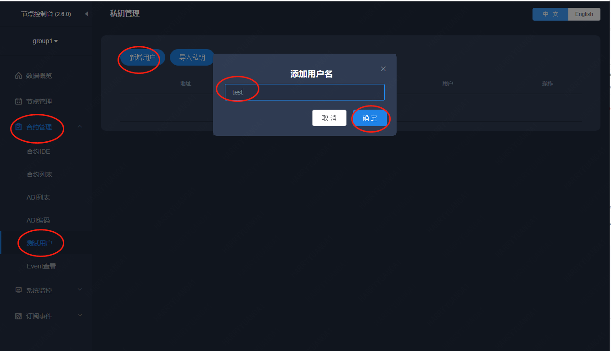
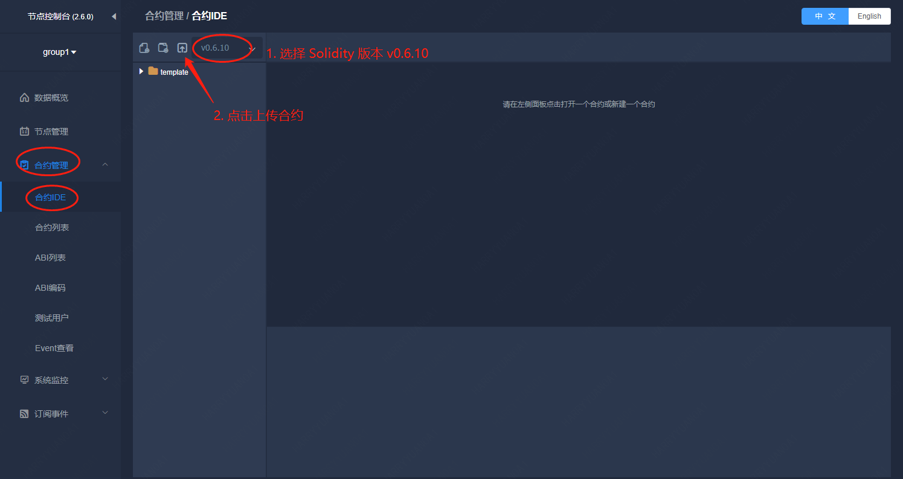
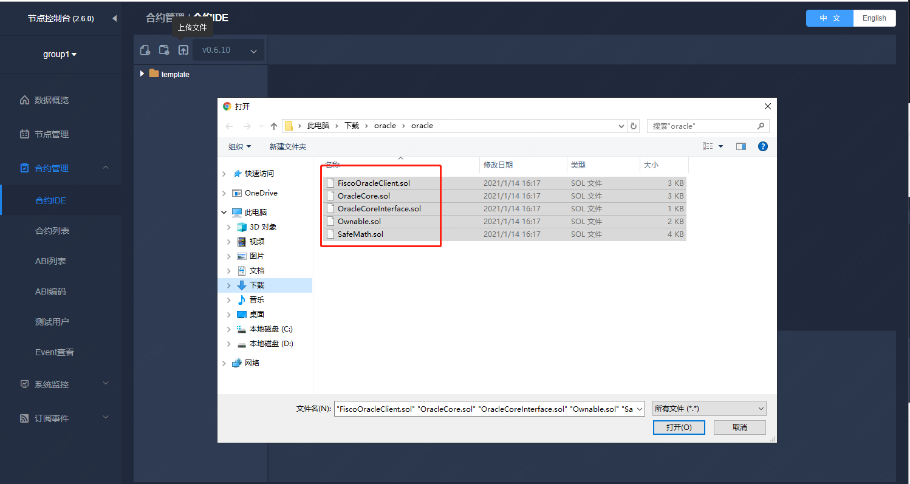
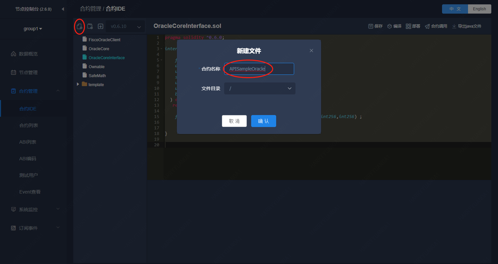
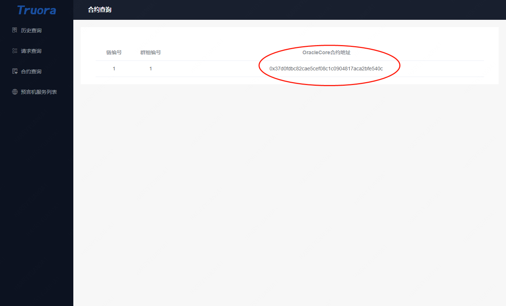
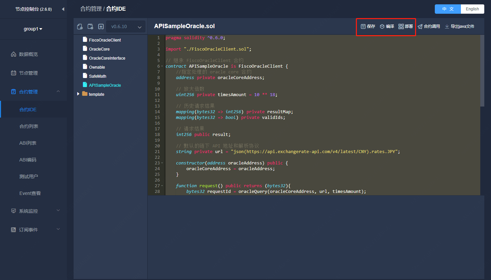
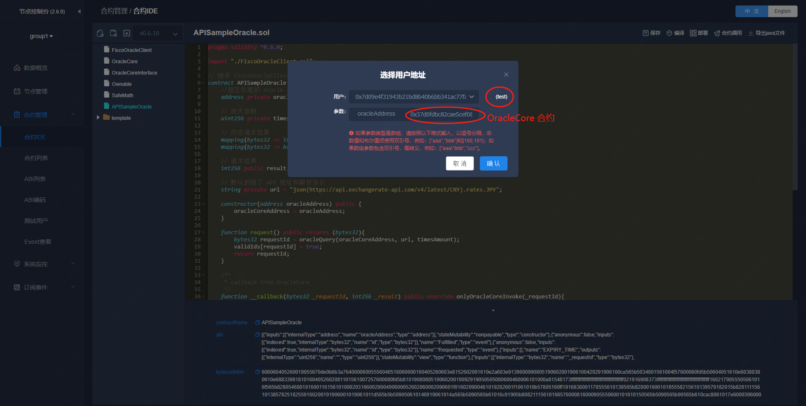
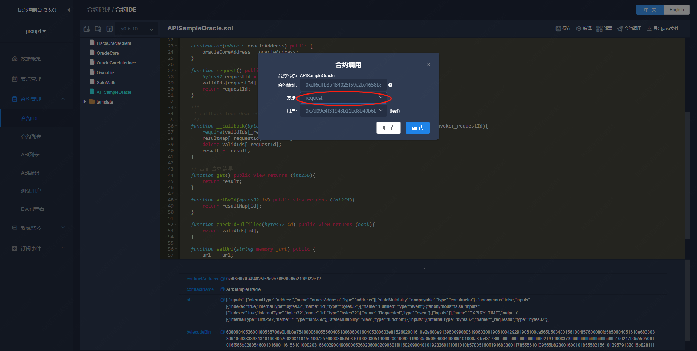
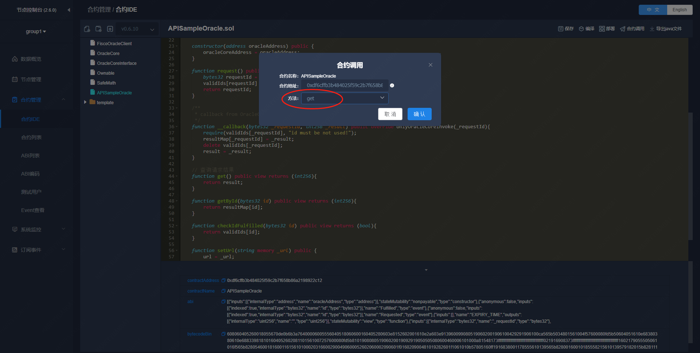
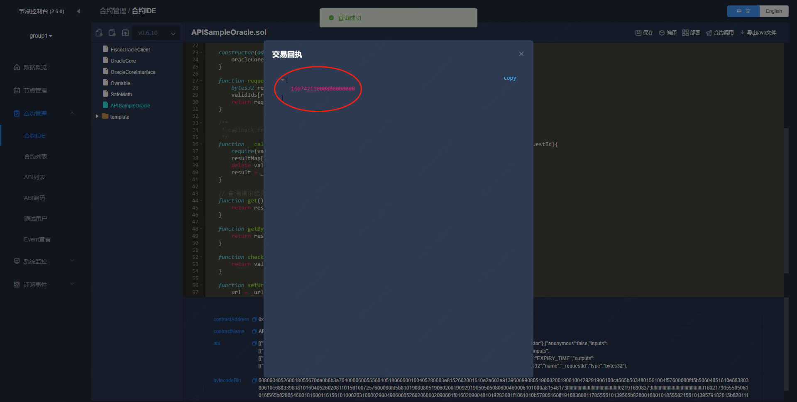

# Truora 开发教程

Truora 预言机服务中有两个角色：

* **Truora 服务运营方**

    服务运运营方需要部署 `Truora-Service` 和 `Truora-Web` 服务，并且部署预言机相关合约到链上，为预言机用户提供服务。

* **预言机用户**
    
    预言机用户需要根据自身业务，选择一个 Truora 服务运营方，并编写预言机合约（需要从服务运营方处获取预言机相关合约的地址），使用服务运营方提供的预言机服务。
  

## 开发流程

预言机服务开发的流程：

1. 获取 预言机 相关合约地址
    * 选择一个 Truora 服务运营方，并从运营方获取到 预言机 相关合约地址
    * 如果没有运营方，可以参考：[安装部署](../Truora-Install/index.html) 自行搭建 Truora 服务。部署完成后，可以通过 Truora-Web 获取 预言机 相关合约地址，请参考：[查询系统合约地址](../Truora-Web/outline.html#list_oracle_address)
    
2. 开发合约
    * 编写，调试合约

## 开发 Truora 合约

### 获取链下 API 数据

 用户可以参考 [APISampleOracle.sol](https://github.com/WeBankBlockchain/Truora-Service/blob/main/contracts/1.0/sol-0.6/oracle/FiscoOracleClient.sol) 合约实现自己的oracle业务合约。
  默认支持`solidity0.6`版本合约。 `solidity0.4` 和 `solidity0.5`均在 `Truora-Service` 同级目录。合约解析如下：
  - 用户合约需继承FiscoOracleClient合约
   ```
    contract APISampleOracle is FiscoOracleClient
   ``` 
  - 构造函数需要传入指定的Truora服务的 `OracleCore`合约 地址。地址可以通过前端界面或者后端接口获取。
   ```
      constructor(address oracleAddress) public {  
            oracleCoreAddress = oracleAddress;      
      }  
   ```       
  - 设定自己要访问的url。修改url变量赋值即可。  
  
   ```
      function request() public returns (bytes32)
        {
    
          // Set your URL
          // url = "plain(https://www.random.org/integers/?num=100&min=1&max=100&col=1&base=10&format=plain&rnd=new)";
             url = "json(https://api.exchangerate-api.com/v4/latest/CNY).rates.JPY";
             bytes32  requestId = oracleQuery(oracleCoreAddress, url, timesAmount);
             validIds[requestId] = true;
             return requestId;
              
        }
   ```
  - 必须实现 **__callback(bytes32 _requestId, int256 _result)** 方法，用于Truora-Service服务回调获取的结果。
  - **get()** 方法获取本次请求结果, 可自行修改此函数, 获取结果后进行自己业务逻辑的计算。  
  
----------
```eval_rst
.. admonition:: **URL格式规范**
    
   目前支持json和text/plain两种访问格式。并且链下API的url必须支持HTTPS访问(安全因素考虑)。  
   遵循jsonpath格式，子元素 用 "." 表示,数组用 "[]"表示，目前只支持单个返回值；     
   text/plain默认取第一行，也可指定数组下标取特定行。 jsonpath规范可以参考 `jsonpath <https://support.smartbear.com/alertsite/docs/monitors/api/endpoint/jsonpath.html>`_ 
     //获取链下随机数API
       plain(https://www.random.org/integers/?num=100&min=1&max=100&col=1&base=10&format=plain&rnd=new)
     //获取人民币对日元汇率API 
       json(https://api.exchangerate-api.com/v4/latest/CNY).rates.JPY  
     // 查询某城市某天最高温度  
       json(https://devapi.qweather.com/v7/weather/3d?location=101280601&key=90d8a8ee98ff495694dce72e96f53a18).daily[1].tempMax
``` 

## 业务合约参考

下面以一个简单抽奖合约为例，介绍下一个简单抽奖业务怎么使用 Truora 预言机合约。
    
 抽奖合约[LotteryOracle.sol](https://github.com/WeBankBlockchain/Truora-Service/blob/main/contracts/1.0/sol-0.6/oracle/LotteryOracle.sol) 实现了一个简单的抽奖逻辑，
 通过使用上述[APISampleOracle.sol](https://github.com/WeBankBlockchain/Truora-Service/blob/main/contracts/1.0/sol-0.6/oracle/FiscoOracleClient.sol) 获取随机数结果。请保证 `APISampleOracle` 合约的url是获取获取随机数的url。
      默认支持`solidity0.6`版本合约。 `solidity0.4` 和 `solidity0.5`自行修改合约第一行的编译器版本即可。合约解析如下：
      
  - 构造函数需要传入获取随机数合约 `APISampleOracle` 地址。  
       ```
          constructor(address randomOracle) public {
                 oracle = APISampleOracle(randomOracle);
                 lotteryId = 0;
                 lottery_state = LOTTERY_STATE.CLOSED;
             }
       ```       
   - 开始抽奖函数需要传入参与者的地址。简单状态校验后，然后通过调用 `APISampleOracle` 的 `request` 函数获取随机数。
      
       ```
          function start_new_lottery(address[] memory _players) public {
                require(lottery_state == LOTTERY_STATE.CLOSED, "can't start a new lottery yet");
                lottery_state = LOTTERY_STATE.OPEN;
                players = _players;
                lotteryId++;
                requestId = oracle.request();
            }
       ```
     
   - 获取抽奖结果函数回返回中奖者地址。`pickWinner` 函数获取随机数结果，并对总参与人数取余，得出中奖者地址。  
      ```
       function pickWinner() public returns(address) {
              require(oracle.checkIdFulfilled(requestId) == false, " oracle query has not been fulfilled!");
      
              int256 randomness  = oracle.getById(requestId);
              uint256 index = uint256(randomness) % players.length;
              address winner = players[index];
              players = new address[](0);
              lottery_state = LOTTERY_STATE.CLOSED;
              emit Winner(lotteryId, winner, randomness);
              return winner;
          }
      ``` 
  
  
  
## 开发示例
### 部署预言机服务

部署 Truora 服务，示例使用 **一键部署**，部署整套开发，调试环境，请参考：[安装部署](../Truora-Install/docker-all.html)。


#### 获取链下 API 数据

##### 编写预言机合约
打开一键部署的 WeBASE-Front 页面，默认：`http://{IP}:5002/WeBASE-Front/`，使用部署主机的 IP 地址替换 `{IP}`。

* 点击左边 **合约管理** --> **测试用户**，创建一个调试用户 `test`




* 点击左边 **合约管理** --> **合约 IDE**，选择 `solidity` 版本，上传模板合约，包括以下 **五个** 合约：

```Bash
FiscoOracleClient.sol
OracleCore.sol
OracleCoreInterface.sol
Ownable.sol
SafeMath.sol
```



* 确认后，选择上传目录，此处选择根目录 `/`




```eval_rst
.. important::

    - 注意需要上传 **五个** 合约文件。
```


* 在 **合约 IDE** 中，创建一个 `APISampleOracle` 合约，继承 `FiscoOracleClient` 合约，如下



代码如下：

```Solidity
pragma solidity ^0.6.0;

import "./FiscoOracleClient.sol";

// 继承 FiscoOracleClient 合约
contract APISampleOracle is FiscoOracleClient {
    //指定处理的 oracle core 合约
    address private oracleCoreAddress;

    // 放大倍数
    uint256 private timesAmount = 10 ** 18;

    // 历史请求结果
    mapping(bytes32 => int256) private resultMap;
    mapping(bytes32 => bool) private validIds;

    // 请求结果
    int256 public result;
    
    // 默认的链下 API 地址和解析协议
    string private url = "json(https://api.exchangerate-api.com/v4/latest/CNY).rates.JPY";

    constructor(address oracleAddress) public {
        oracleCoreAddress = oracleAddress;
    }

    function request() public returns (bytes32){
        bytes32 requestId = oracleQuery(oracleCoreAddress, url, timesAmount);
        validIds[requestId] = true;
        return requestId;
    }

    /**
     * callback from OracleCore
     */
    function __callback(bytes32 _requestId, int256 _result) public override onlyOracleCoreInvoke(_requestId){
        require(validIds[_requestId], "id must be not used!");
        resultMap[_requestId] = _result;
        delete validIds[_requestId];
        result = _result;
    }

    // 查询请求结果
    function get() public view returns (int256){
        return result;
    }

    function getById(bytes32 id) public view returns (int256){
        return resultMap[id];
    }

    function checkIdFulfilled(bytes32 id) public view returns (bool){
        return validIds[id];
    }

    function setUrl(string memory _url) public {
        url = _url;
    }

    function getUrl() public view returns (string memory){
        return url;
    }
}
```

##### 获取合约地址

在部署 `APISampleOracle` 时，需要获取 `OracleCore` 合约地址，可以通过 Truora-Web 查看。




如果需要使用 `RESTful` 接口获取，请参考：[OracleCore 合约地址查询接口](../Truora-Service/interface.html#list_oracle_address)

##### 部署合约

选择 `APISampleOracle` 合约文件，依次点击 **保存** --> **编译** 编译合约。



点击 **部署** 按钮，部署 `APISampleOracle` 合约，选择刚刚创建的测试用户 `test`，输入 `OracleCore` 合约地址：




##### 合约调用
调用 `APISampleOracle` 合约的 `request` 方法，触发预言机获取数据




调用 `APISampleOracle` 合约的 `get` 方法，查看预言机返回的结果


结果显示如下，此处是获取日元到人民币的汇率，放大 `10^18` 倍的结果：




