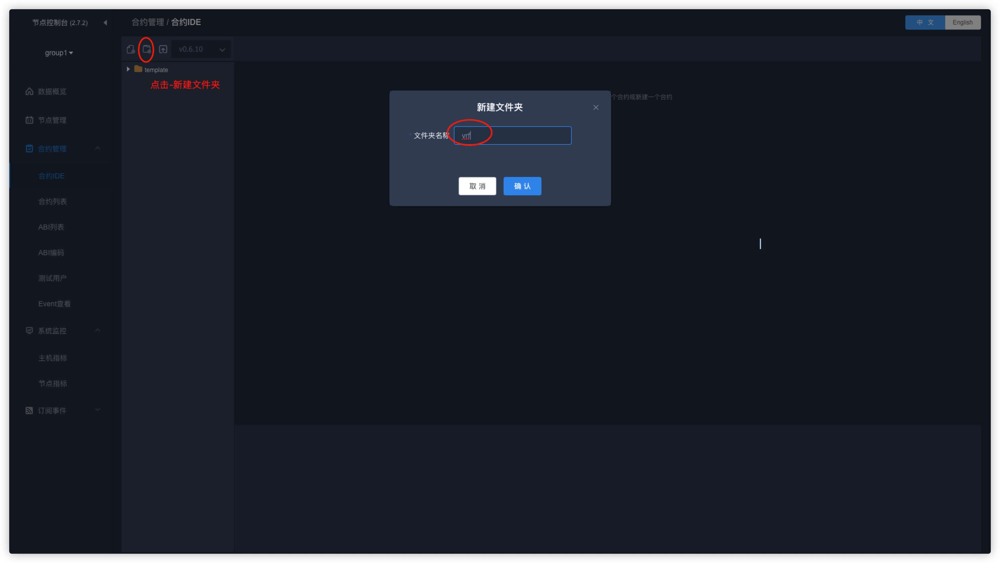
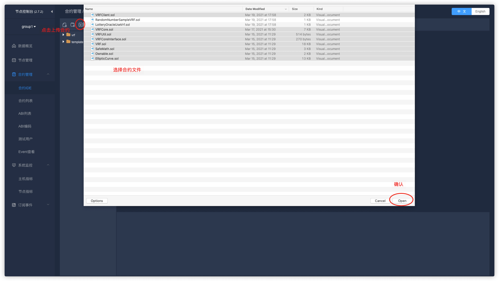
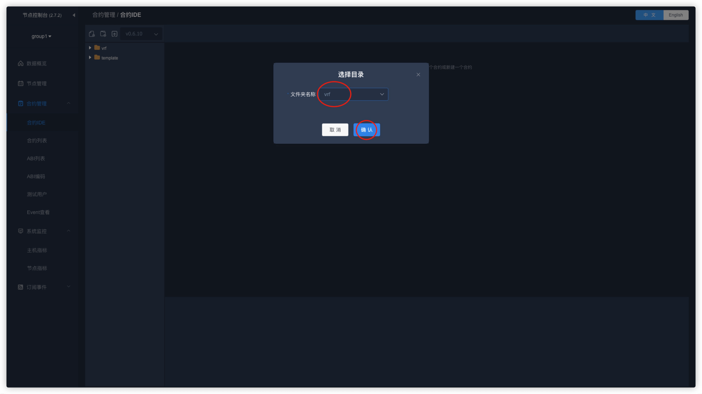
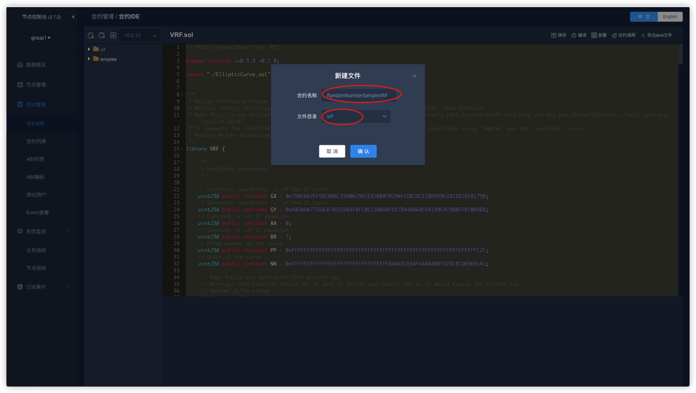
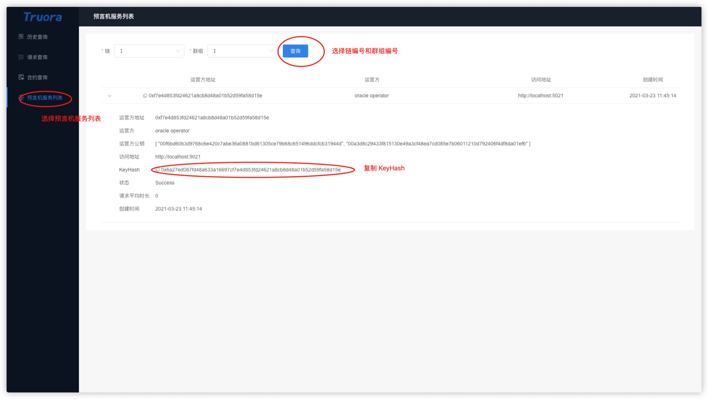
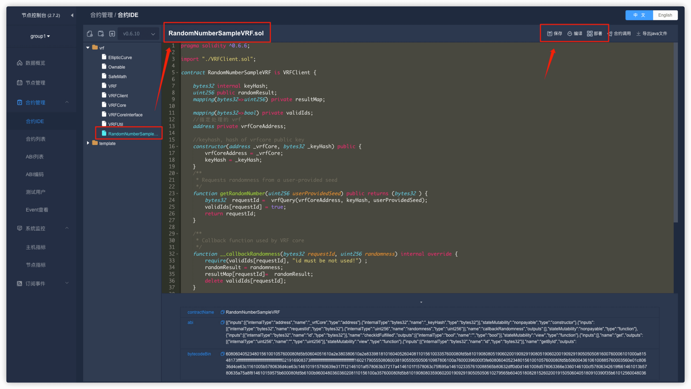
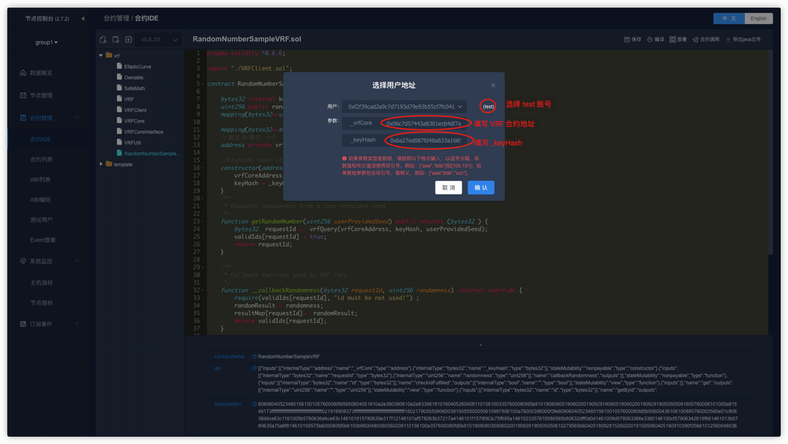
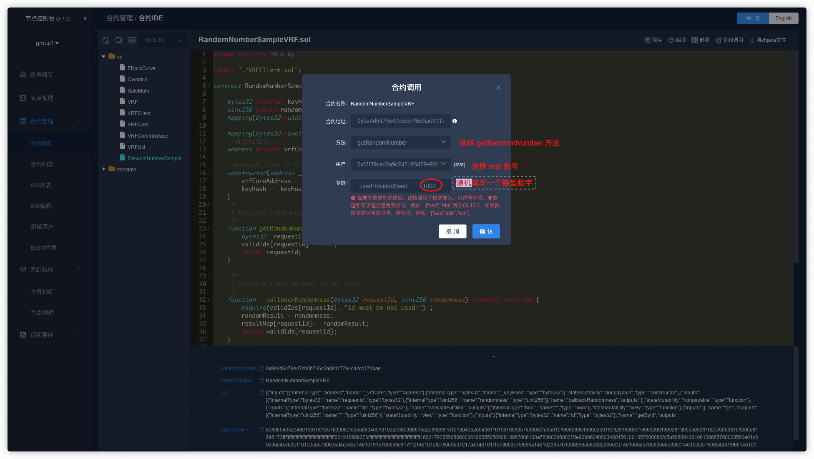
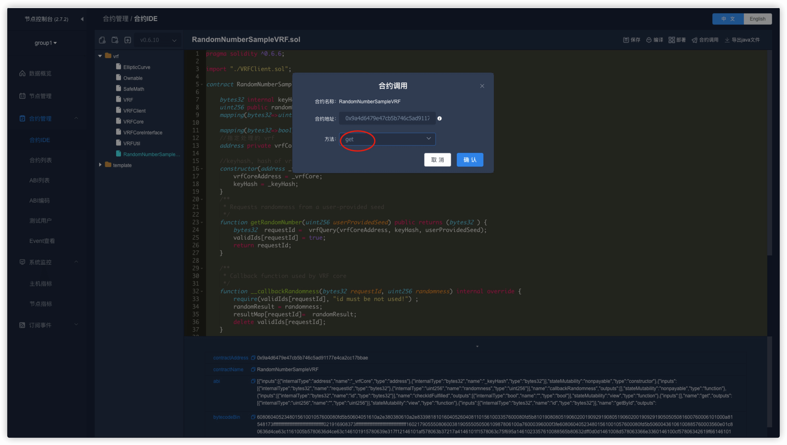
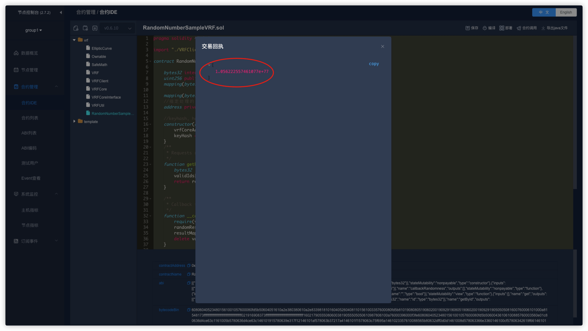

# Truora 开发教程

Truora 预言机服务中有两个角色：

* **Truora 服务运营方**

    服务运运营方需要部署 `Truora-Service` 和 `Truora-Web` 服务，并且部署预言机相关合约到链上，为预言机用户提供服务。

* **预言机用户**
    
    预言机用户需要根据自身业务，选择一个 Truora 服务运营方，并编写预言机合约（需要从服务运营方处获取预言机相关合约的地址），使用服务运营方提供的预言机服务。
  

## 开发流程

预言机服务开发的流程：

1. 获取 预言机 相关合约地址
    * 选择一个 Truora 服务运营方，并从运营方获取到 预言机 相关合约地址
    * 如果没有运营方，可以参考：[安装部署](../Truora-Install/index.html) 自行搭建 Truora 服务。部署完成后，可以通过 Truora-Web 获取 预言机 相关合约地址，请参考：[查询系统合约地址](../Truora-Web/outline.html#list_oracle_address)
    
2. 开发合约
    * 编写，调试合约

## 开发 Truora 合约

### 获取链下 API 数据

用户可以参考 [APISampleOracle.sol](https://github.com/WeBankBlockchain/Truora-Service/blob/main/contracts/1.0/sol-0.6/oracle/APISampleOracle.sol) 合约实现自己的oracle业务合约。

默认支持`solidity0.6`版本合约。 `solidity0.4`在 `Truora-Service` 同级目录。合约解析如下：

  - 用户合约需继承FiscoOracleClient合约
   ```
    contract APISampleOracle is FiscoOracleClient
   ``` 

  - 构造函数需要传入指定的Truora服务的 `OracleCore`合约 地址。地址可以通过前端界面或者后端接口获取。
   ```
      constructor(address oracleAddress) public {  
            oracleCoreAddress = oracleAddress;      
      }  
   ```       
  - 设定自己要访问的url。修改url变量赋值即可，并且指定需要返回值类型。   
    目前只支持单个返回值，返回值可以是 `string`,`int256`,`bytes`三种类型。   
    调用`request`需要指定返回值类型，默认类型是 `int256`，因为solidity不支持浮点数，返回 `int256` 类型需要指定放大倍数 `timesAmount`。    
    如果返回值是`string`,请参考[APISampleOracleReturnString.sol](https://github.com/WeBankBlockchain/Truora-Service/blob/main/contracts/1.0/sol-0.6/oracle/APISampleOracleReturnString.sol)合约。


   ```
      function request() public returns (bytes32)
        {
          // default return type is INT256
          //returnType = ReturnType.STRING;


          // Set your URL
          // url = "plain(https://www.random.org/integers/?num=100&min=1&max=100&col=1&base=10&format=plain&rnd=new)";
             url = "json(https://api.exchangerate-api.com/v4/latest/CNY).rates.JPY";
             bytes32  requestId = oracleQuery(oracleCoreAddress, url, timesAmount);
             validIds[requestId] = true;
             return requestId;
              
        }
   ```

  - 必须实现 **__callback(bytes32 _requestId, bytes memory _result)** 方法，用于`Truora-Service`服务回调获取的结果。

  - **get()** 方法获取本次请求结果, 可自行修改此函数, 获取结果后进行自己业务逻辑的计算。  
  
----------

```eval_rst
.. admonition:: **URL格式规范**
    
    目前支持json和text/plain两种访问格式。并且链下API的url建议支持HTTPS访问(安全因素考虑)。  
    遵循jsonpath格式，子元素 用 "." 表示,数组用 "[]"表示。
     
    text/plain默认取第一行，也可指定数组下标取特定行。 jsonpath规范可以参考 `jsonpath <https://support.smartbear.com/alertsite/docs/monitors/api/endpoint/jsonpath.html>`_ 
    
     //获取链下随机数API
       plain(https://www.random.org/integers/?num=100&min=1&max=100&col=1&base=10&format=plain&rnd=new)
     //获取人民币对日元汇率API 
       json(https://api.exchangerate-api.com/v4/latest/CNY).rates.JPY  
     // 查询某城市某天最高温度  
       json(https://devapi.qweather.com/v7/weather/3d?location=101280601&key=90d8a8ee98ff495694dce72e96f53a18).daily[1].tempMax
``` 

### 获取VRF随机数

用户可以参考 [RandomNumberSampleVRF.sol](https://github.com/WeBankBlockchain/Truora-Service/blob/main/contracts/1.0/sol-0.6/oracle/simple-vrf/RandomNumberSampleVRF.sol) 合约实现自己的oracle业务合约,
  默认支持`solidity0.6`版本合约。 `solidity0.4` 在 `Truora-Service` 同级目录。合约解析如下：
  - 用户合约需继承 `VRFClient` 合约
   ```
    contract RandomNumberSampleVRF is VRFClient
   ``` 

  - 构造函数需要传入指定的Truora服务方的 `VRFCore`合约地址和公钥哈希值。地址和哈希值都可以通过前端界面或者后端接口获取。
   ```
      constructor(address _vrfCore, bytes32 _keyHash) public {
             vrfCoreAddress = _vrfCore;
             keyHash = _keyHash;
         }
   ```       
  - 设定自己提供的随机数种子值。 
  
   ```
       function getRandomNumber(uint256 userProvidedSeed) public returns (bytes32 ) {
            bytes32  requestId =  vrfQuery(vrfCoreAddress, keyHash, userProvidedSeed);
            validIds[requestId] = true;
            return requestId;
        }
   ```

  - 必须实现 **__callbackRandomness(bytes32 requestId, uint256 randomness)** 方法，用于 `Truora-Service`服务回调获取的结果。
  - **get()** 方法获取本次随机数请求结果, 可自行修改此函数, 获取结果后进行自己业务逻辑的计算。  
  
   

## 业务合约参考

下面以一个简单抽奖合约为例，介绍下一个简单抽奖业务怎么使用 Truora 预言机合约。
    
 抽奖合约[LotteryOracle.sol](https://github.com/WeBankBlockchain/Truora-Service/blob/main/contracts/1.0/sol-0.6/oracle/LotteryOracle.sol) 实现了一个简单的抽奖逻辑，
 通过使用上述[APISampleOracle.sol](https://github.com/WeBankBlockchain/Truora-Service/blob/main/contracts/1.0/sol-0.6/oracle/FiscoOracleClient.sol) 获取随机数结果。请保证 `APISampleOracle` 合约的url是获取获取随机数的url。
      默认支持`solidity0.6`版本合约。 `solidity0.4`自行修改合约第一行的编译器版本即可。合约解析如下：
      
  - 构造函数需要传入获取随机数合约 `APISampleOracle` 地址。  
       ```
    
    contract LotteryOracle {
    
        enum LOTTERY_STATE { OPEN, CLOSED }
        LOTTERY_STATE public lottery_state;
        address[] public players;
        uint256 public lotteryId;
        APISampleOracle private oracle;
        bytes32  private requestId;
        event Winner(uint256  lotteryId, address winner ,int256 ramdomness);
    
    
        constructor(address randomOracle) public {
            oracle = APISampleOracle(randomOracle);
            lotteryId = 0;
            lottery_state = LOTTERY_STATE.CLOSED;
        }
       ```       
   - 开始抽奖函数需要传入参与者的地址。简单状态校验后，然后通过调用 `APISampleOracle` 的 `request` 函数获取随机数。
      
       ```
          function start_new_lottery(address[] memory _players) public {
                require(lottery_state == LOTTERY_STATE.CLOSED, "can't start a new lottery yet");
                lottery_state = LOTTERY_STATE.OPEN;
                players = _players;
                lotteryId++;
                requestId = oracle.request();
            }
       ```
     
   - 获取抽奖结果函数回返回中奖者地址。`pickWinner` 函数获取随机数结果，并对总参与人数取余，得出中奖者地址。  
      ```
       function pickWinner() public returns(address) {
              require(oracle.checkIdFulfilled(requestId) == false, " oracle query has not been fulfilled!");
      
              int256 randomness  = oracle.getById(requestId);
              uint256 index = uint256(randomness) % players.length;
              address winner = players[index];
              players = new address[](0);
              lottery_state = LOTTERY_STATE.CLOSED;
              emit Winner(lotteryId, winner, randomness);
              return winner;
          }
      ``` 
     
 `V1.1.0`版本已加入通过VRF产生链上安全可验证随机数方案，用户也可参考
 [LotteryOracleUseVrf.sol](https://github.com/WeBankBlockchain/Truora-Service/blob/main/contracts/1.0/sol-0.6/oracle/simple-vrf/LotteryOracleUseVrf.sol) 抽奖逻辑大部分相同，只是获取随机数获取方式从 `api` 方式改成 `vrf` 方式。
     
## fiscoOracleClient 合约解析

  - 抽象合约，__callback方法待实现。
  
```
function __callback(bytes32 requestId, int256 result) public {}
```

   - 发起`oracle`请求，`oracleQuery` 函数会传入相关参数并调用 `oracleCore` 合约的 `query`方法。

```  
  function oracleQuery(uint expiryTime, string memory datasource, address _oracle, string memory url, uint256 timesAmount, bool needProof) internal
  returns (bytes32 requestId) {
    // calculate the id;
    oracle = OracleCoreInterface(_oracle);
    int256 chainId;
    int256 groupId;
    ( chainId, groupId) = oracle.getChainIdAndGroupId();
    requestId = keccak256(abi.encodePacked(chainId, groupId, this, requestCount));
    pendingRequests[requestId] = _oracle;
    emit Requested(requestId);

    require(oracle.query(address(this),requestCount, url,timesAmount, expiryTime,needProof),"oracle-core invoke failed!");
    requestCount++;
    reqc[msg.sender]++;

    return requestId;
  }
```
  
## VRFClient 合约解析

  - 抽象合约，__callback方法待实现。
  
```
 function __callbackRandomness(bytes32 requestId, uint256 randomness) internal virtual;
```

   - 发起`oracle`随机数请求，`vrfQuery` 函数会传入相关参数并调用 `VRFCore` 合约的 `randomnessRequest`方法。
   为了保证用户提供的种子足够随机，`randomnessRequest`函数会把用户种子 （`_consumerSeed`）, 预言机服务方公钥哈希 （`_keyHash）`, 
   用户合约地址 （`_sender`） ,用户合约发送请求次数（`nonce`），区块哈希（`blockhash`）一起做哈希处理得出最终`VRF`随机数种子。  

```  
   function randomnessRequest(
      bytes32 _keyHash,
      uint256 _consumerSeed,
      address _sender) external returns(bool) {
      // record nonce
      uint256 nonce = nonces[_keyHash][_sender];
      // preseed
      uint256 preSeed = makeVRFInputSeed( _keyHash, _consumerSeed, _sender, nonce);
  
      bytes32 requestId = makeRequestId(chainId, groupId, _keyHash, preSeed);
      // Cryptographically guaranteed by preSeed including an increasing nonce
      assert(callbacks[requestId].callbackContract == address(0));
      callbacks[requestId].callbackContract = _sender;
      callbacks[requestId].seedAndBlockNum = keccak256(abi.encodePacked(
          preSeed, block.number));
      emit RandomnessRequest(address (this), _keyHash, preSeed, block.number,
        _sender, requestId, callbacks[requestId].seedAndBlockNum, _consumerSeed);
      nonces[_keyHash][_sender] = nonces[_keyHash][_sender].add(1);
      return true;
    }
```

  - VRF随机数验证逻辑可以参考 `VRFCore`的`getRandomnessFromProof` 方法。
  
## 开发示例
### 部署预言机服务

部署 Truora 服务，示例使用 **一键部署**，部署整套开发，调试环境，请参考：[安装部署](../Truora-Install/docker-all.html)。


### 获取链下 API 数据

#### 编写预言机合约
打开一键部署的 WeBASE-Front 页面，默认：`http://{IP}:5002/WeBASE-Front/`，使用部署主机的 IP 地址替换 `{IP}`。

* 点击左边 **合约管理** --> **测试用户**，创建一个调试用户 `test`


* 点击左边 **合约管理** --> **合约 IDE**，选择 `solidity` 版本，上传 Oracle 相关合约，包括以下几个合约：

```Bash
FiscoOracleClient.sol
OracleCore.sol
OracleCoreInterface.sol
Ownable.sol
SafeMath.sol
```

gitee 仓库：[Oracle 相关合约目录](https://gitee.com/WeBankBlockchain/Truora-Service/tree/main/contracts/1.0/sol-0.6/oracle)    
GitHub 仓库：[Oracle 相关合约目录](https://github.com/WeBankBlockchain/Truora-Service/tree/main/contracts/1.0/sol-0.6/oracle)


* 确认后，选择上传目录，此处选择根目录 `/`


```eval_rst
.. important::

    - 注意需要上传 **五个** 合约文件。
```


* 在 **合约 IDE** 中，创建一个 `APISampleOracle` 合约，继承 `FiscoOracleClient` 合约，如下


APISampleOracle 合约的代码，请参考：

gitee: [APISampleOracle.sol 合约](https://gitee.com/WeBankBlockchain/Truora-Service/blob/main/contracts/1.0/sol-0.6/oracle/APISampleOracle.sol)    
GitHub: [APISampleOracle.sol 合约](https://github.com/WeBankBlockchain/Truora-Service/blob/main/contracts/1.0/sol-0.6/oracle/APISampleOracle.sol)

#### 获取合约地址

在部署 `APISampleOracle` 时，需要获取 `OracleCore` 合约地址，可以通过 Truora-Web 查看。


如果需要使用 `RESTful` 接口获取，请参考：[OracleCore 合约地址查询接口](../Truora-Service/interface.html#list_oracle_address)

#### 部署合约

选择 `APISampleOracle` 合约文件，依次点击 **保存** --> **编译** 编译合约。


点击 **部署** 按钮，部署 `APISampleOracle` 合约，选择刚刚创建的测试用户 `test`，输入 `OracleCore` 合约地址：


#### 合约调用
调用 `APISampleOracle` 合约的 `request` 方法，触发预言机获取数据


调用 `APISampleOracle` 合约的 `get` 方法，查看预言机返回的结果


结果显示如下，此处是获取日元到人民币的汇率，放大 `10^18` 倍的结果：


### 获取 VRF 随机数

#### 编写预言机合约
打开一键部署的 WeBASE-Front 页面，默认：`http://{IP}:5002/WeBASE-Front/`，使用部署主机的 IP 地址替换 `{IP}`。

* 点击左边 **合约管理** --> **测试用户**，创建一个调试用户 `test`


* 点击左边 **合约管理** --> **合约 IDE**，选择切换 `solidity` 版本


* 先创建一个 `vrf` 目录，点击确认



* 上传 VRF 相关合约，包括以下几个合约：

```Bash
EllipticCurve.sol
Ownable.sol
SafeMath.sol
VRF.sol
VRFClient.sol
VRFCore.sol
VRFCoreInterface.sol
VRFUtil.sol
```

gitee 仓库：[VRF 相关合约目录](https://gitee.com/WeBankBlockchain/Truora-Service/tree/main/contracts/1.0/sol-0.6/oracle/simple-vrf)        
GitHub 仓库：[VRF 相关合约目录](https://github.com/WeBankBlockchain/Truora-Service/tree/main/contracts/1.0/sol-0.6/oracle/simple-vrf)


* 确认后，选择上传目录，此处选择根目录 `/vrf`






```eval_rst
.. important::

    - 注意需要上传 **八个** 合约文件。
```


* 在 **合约 IDE** 中，创建一个 `RandomNumberSampleVRF` 合约，选中 `vrf` 目录，继承 `VRFClient` 合约，如下




具体代码，请参考：

gitee: [RandomNumberSampleVRF.sol 合约](https://gitee.com/WeBankBlockchain/Truora-Service/blob/main/contracts/1.0/sol-0.6/oracle/simple-vrf/RandomNumberSampleVRF.sol)    
GitHub: [RandomNumberSampleVRF.sol 合约](https://github.com/WeBankBlockchain/Truora-Service/blob/main/contracts/1.0/sol-0.6/oracle/simple-vrf/RandomNumberSampleVRF.sol)

#### 获取合约地址和 _keyHash

* 获取 `VRF` 合约地址

在部署 `RandomNumberSampleVRF` 时，需要获取 `VRF` 合约地址，可以通过 Truora-Web 查看。


如果需要使用 `RESTful` 接口获取，请参考：[VRFCore 合约地址查询接口](../Truora-Service/interface.html#list_oracle_address)

* 获取 `_keyHash`




#### 部署合约

选择 `RandomNumberSampleVRF` 合约文件，依次点击 **保存** --> **编译** 编译合约。




点击 **部署** 按钮，部署 `RandomNumberSampleVRF` 合约，选择刚刚创建的测试用户 `test`，输入 `OracleCore` 合约地址：




#### 合约调用
调用 `RandomNumberSampleVRF` 合约的 `getRandomNumber` 方法，`userProvidedSeed` 处填写任意一个随机的整型数字即可，点击 **确认** 触发预言机生成随机数




调用 `RandomNumberSampleVRF` 合约的 `get` 方法，查看预言机返回的随机数结果


结果显示如下，表示生成的链上随机数结果。




