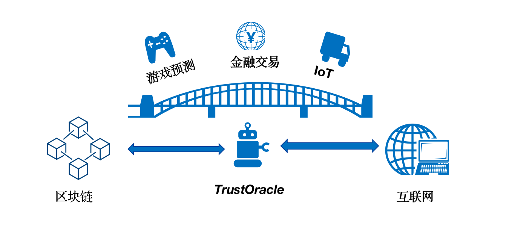

# TrustOracle介绍

## 预言机简介
```eval_rst 
.. admonition:: **预言机简介**

  区块链是一个确定性的、封闭的系统环境，智能合约不管何时何地运行都必须是一致的结果，所以虚拟机（VM）不能让智能合约有网络调用，不然结果就是不确定的。  

  智能合约不能直接获取到链外真实世界的数据，导致区块链与现实世界是割裂的，也极大地限制了区块链的应用场景。
  而如何将区块链和现实世界连接起来，就需要引入预言机服务，通过预言机将现实世界的数据输入到区块链上，为智能合约提供与外部世界的连接性。

  中国人民银行发布的《区块链能做什么？不能做什么？》报告中，是这样对预言机定义的：
    "区块链外信息写入区块链内的机制，一般被称为预言机 (oracle mechanism)。"

```

## TrustOracle简介
```eval_rst 
.. admonition:: **TrustOracle简介**

 TrustOracle 是 `FISCO-BCOS <https://github.com/FISCO-BCOS/FISCO-BCOS>`_ 区块链平台的预言机服务解决方案，是在广泛调研的基础上针对 **联盟链** 场景设计的可信预言机服务。

 区块链愈发展，对链下数据的需求就会愈强烈，预言机的重要性也会愈发凸显。

 作为连接 `FISCO-BCOS` 联盟链和互联网的桥梁，TrustOracle致力于解决互联网数据安全可信的上链，助力扩宽联盟链的应用场景和丰富联盟链的生态。

 TrustOracle 服务主要由后端 `Java` 组件 `TrustOracle-Service <https://github.com/WeBankBlockchain/TrustOracle-Service>`_ 和前端 `Vue` 组件 `TrustOracle-Web <https://github.com/WeBankBlockchain/TrustOracle-Web>`_ 组成。
```


## 设计原则
```eval_rst 
.. admonition:: **设计原则**  

   TrustOracle是一整套预言机方案解决的集合，包含中心化和去中心化部署，用户可以针对不同的业务场景选择适合的部署方式。
   此外，不局限于解决互联网数据上链，会结合联盟链场景制定数据提供商的规范，如数据格式规范，治理规范。以给联盟链提供可信可验证的优质数据。  
   
   **中心化部署**   
   针对请求时延低，信任要求不是很高的场景，主要着力于搭建方便，结合联盟链场景，主要问题是解决中心化机构作恶问题。

   - 软件上会深入研究TLS技术，并进行改造。 暴露连接细节以及链上数据验签。  
   - 硬件上支持TEE等安全环境下的部署。 
 
   **去中心化部署**
   主要分为链上聚合和链下聚合

   **对于数据方面**
   支持获取互联网上的数据，同时也会制定联盟链数据提供标准，引入优质数据服务提供商，为联盟链提供优质可信的数据服务。
```

## 主要特性

```eval_rst 
.. admonition:: **主要特性**

    - 链下 HTTPS API 数据获取
    - 支持多链多群组服务（必须同为 `ECDSA` 或 国密）
    - 支持VRF随机数生成
    - 支持国密
    - 支持集群部署
    - 支持中心化部署和去中心化部署
    - 支持多数据格式访问
    - 支持请求状态查询
```

## 应用场景
```eval_rst 
.. admonition:: **应用场景**
   
    - **游戏/预测市场方面:**
       获取链上安全的随机数，智能合约实现更公平游戏场景。
    - **物联网方面:**
       对于IoT应用，将传感器信息上链，智能合约验证并触发下一步的行为。
    - **供应链金融方面:**
       获取链下订单信息和汇率信息等。
```

## 路线图

```eval_rst 
.. admonition:: **技术路线**

   目前已完成中心化方式获取链下数据， TrustOracle在2021年度的技术路线如下：
    - **Q1--TrustOracle中心化预言机功能**   
 
      主要完成中心化预言机功能，支持国密和非国密环境下的链下API访问和VRF功能，支持监听多链多群组，支持请求的加密，预言机采集数据签名和链上验签。
    - **Q2--TrustOracle去中心化预言机功能** 
 
      主要完成去中心化预言机的链上聚合功能。支持TrustOracle的分布式部署以及结果的链上聚合（求平均，中位数，最大值，最小值），和数据提供商规范制定， 增加AMOP的支持。
    - **Q3--TrustOracle解决方案**  

      主要完成基于TustOracle应用实例开发。如物联网，供应链金融，游戏等场景结合预言机开发具体的应用实例。
    - **Q4--TrustOracle去中心化预言机功能** 
 
      主要完成去中心化预言机的链下聚合功能，增加p2p网络以及密码学套件，支持BLS门限签名技术，实现链下聚合功能。
```


```eval_rst 
.. important::

   - 本技术文档只适用 FISCO BCOS 2.6+
   - FISCO BCOS 2.6+ 版本及兼容性说明 `这里 <https://fisco-bcos-documentation.readthedocs.io/zh_CN/latest/docs/change_log/index.html>`_
``` 