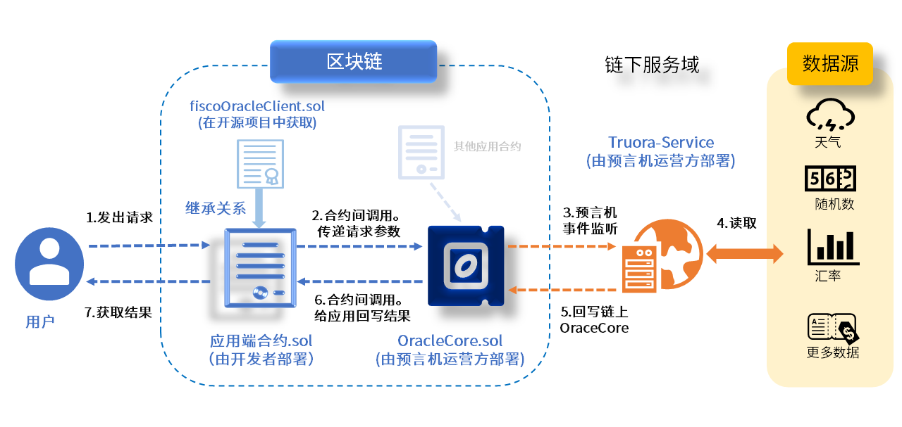
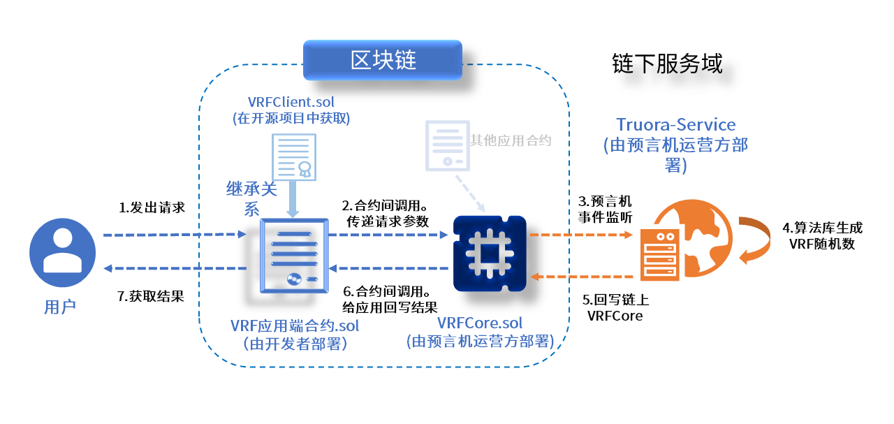

# 架构原理解析

[](https://www.apache.org/licenses/LICENSE-2.0.html)    


```eval_rst
.. admonition:: **简介**

    `Truora-Service <https://github.com/WeBankBlockchain/Truora-Service>`_ 是 Truora 的后台服务，主要分为链上部分和链下部分。  
    链上部分主要是 `oracle` 相关合约，链下部分主要是 `Java` 服务，负责连接节点，监听合约的事件，采集结果并回写到 `oracle` 合约。  

    `Truora-Service` 支持多集群部署(监听同一条链并共用同一个数据库)。

```

Truora-Service 目前主要支持获取链下API,链上可验证随机数（VRF），后续会陆续开源去中心化预言机功能。

## 获取链下API原理图:
     
   

  用户发起调用后，继承于`FiscoOracleClient`的应用端合约会调用 `OracleCore` 合约，此时会发起一个事件。`Truora-Service` 监听到事件后， 会从事件信息中取出以下几个信息字段：
  
   - 请求编号（唯一）
   - 请求地址和数据解析格式（URL）
   - 倍数（防止小数,solidity 不支持浮点数）
   - 返回值类型（支持 string，int256, bytes三种）
     
  `Truora-Service` 获取到数据后，对 URL 发起一个 HTTP 调用，获取到数据，对数据按照解析格式进行处理，然后再调用 `OracleCore` 合约，根据请求编号将结果上传到链上，提供给其他合约来获取。

## 获取链上可验证随机数（VRF):
  
 
  **可验证随机函数**( Verifiable Random Function ，简写 VRF )是一种将输入映射为可验证的伪随机输出的加密方案。广泛应用于区块链的共识算法，智能合约产生随机数场景中。  
  本方案参照 [VRF规范标准化文档](https://tools.ietf.org/html/draft-irtf-cfrg-vrf-06#section-5)实现,
  `VRF`原理可以参考文档[VRF原理](./VRF.md)   
  用户发起调用后，需要传入随机数种子，继承于`VRFClient`的应用合约会调用 `VRFCore` 合约，此时会发起一个事件。`Truora-Service` 监听到事件后,会从事件信息中取出以下几个信息字段：
   - 请求编号（唯一）
   - 用户输入随机数种子
   - 预言机公钥哈希
   - 实际参与VRF计算的随机数种子  
   - 块高    
 
   `Truora-Service` 获取到数据后，使用服务私钥和实际随机数种子调用`vrf`函数生成随机数和`proof`，然后再调用 `VRFCore` 合约，`VRFCore`合约会验证`proof`的准确性，通过后，则根据请求编号将随机数结果回写到用户合约。

```eval_rst 
.. admonition:: 提示

   - 随机数种子要保持足够随机性，为了安全，实际参与VRF运算的随机数种子是由用户随机数种子，用户合约地址，预言机公钥哈希，用户请求次数，以及当前区块哈希值五个变量哈希处理后的值做为随机数种子。
   - 本方案采用的是SECP256K1_SHA256_TAI加密套件，参考实现 `ECVRF <https://tools.ietf.org/html/draft-irtf-cfrg-vrf-06#section-5/>`_。
   - vrf底层库采用rust实现，proof验证采用solidity实现。
   - vrf标准规范中尚未有基于SM2，SM3的实现，本方案暂不支持国密。

```    
  
## VRF算法库

VRF随机数生成采用rust算法库，github连接:

```
https://github.com/WeBankBlockchain/ecvrf-rs
````

基于FFI接口实现VRF随机数的生成、验证。

[FFI接口代码文件](https://github.com/WeBankBlockchain/ecvrf-rs/blob/master/src/vrf_ffi.rs)

[示例和单元测试代码文件](https://github.com/WeBankBlockchain/ecvrf-rs/blob/master/examples/vrf_ffi_sample.rs)

JAVA端代码封装参见: `com.webank.truora.vrfutils.VRFUtils`

预编译的二进制库文件参见 `src/main/resources/`路径下的`libecvrf.so` (linux)和 `ecvrf.dll`(windows)

目前该库支持linux(centos/ubuntu)主流版本和windows10/11版本，均为64位版本。

如有更多的平台需要支持，建议clone此rust算法库，在rust开发环境下进行本地编译。

       
**vrf标准规范中尚未有基于SM2，SM3的实现，本方案暂不支持国密** 
