## 开发实操步骤
### 部署预言机服务

部署 Truora 服务。

### 获取链下 API 数据

#### 编写预言机合约

以下采用WeBASE-Front示例，也可以用熟悉的合约开发环境进行开发。

WeBASE相关服务需要参照WeBASE项目文档自行部署。

打开WeBASE-Front 页面，默认：`http://{IP}:5002/WeBASE-Front/`，使用部署主机的 IP 地址替换 `{IP}`。

* 点击左边 **合约管理** --> **测试用户**，创建一个调试用户 `test`

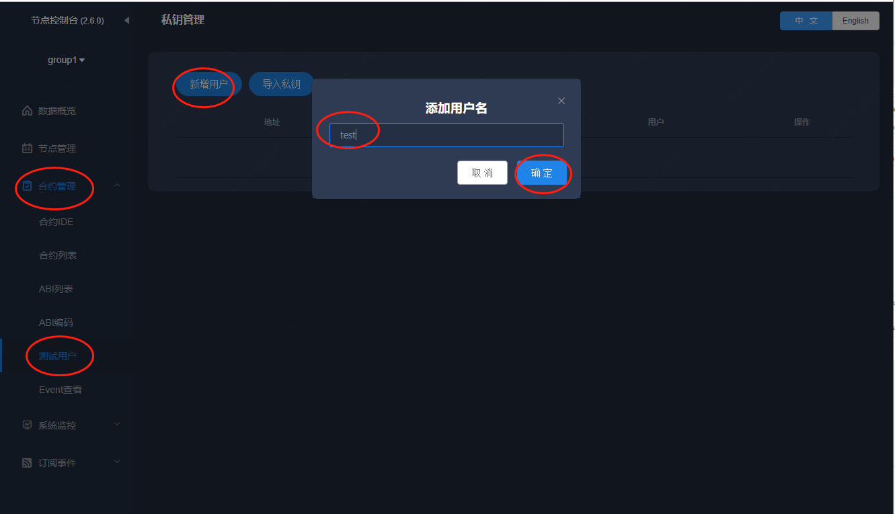


* 点击左边 **合约管理** --> **合约 IDE**，选择 `solidity` 版本，上传 Oracle 相关合约，包括以下几个合约：

```Bash
FiscoOracleClient.sol
GeneralOracle.sol
OracleCore.sol
OracleCoreInterface.sol
Ownable.sol
SafeMath.sol
```

gitee 仓库：[Oracle 相关合约目录](https://gitee.com/WeBankBlockchain/Truora-Service/tree/main/contracts/1.0/sol-0.6/oracle) 
<br/>
GitHub 仓库：[Oracle 相关合约目录](https://github.com/WeBankBlockchain/Truora-Service/tree/main/contracts/1.0/sol-0.6/oracle)

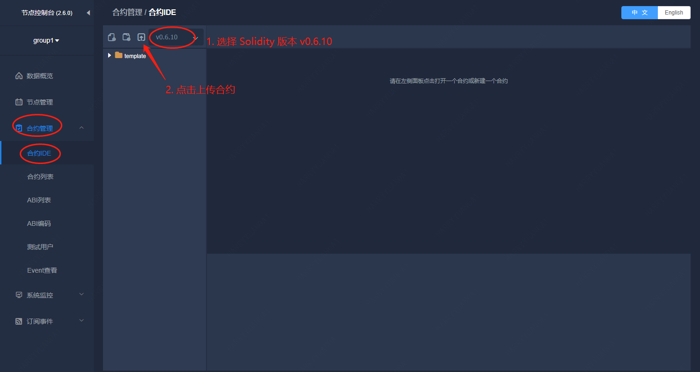

* 确认后，选择上传目录，此处选择根目录 `/`

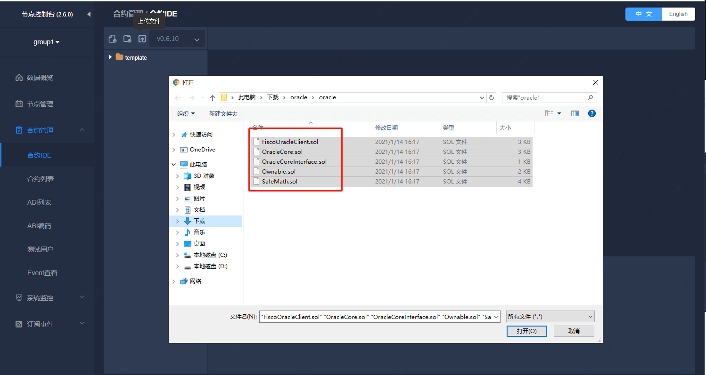


```eval_rst
.. important::

    - 注意需要上传 **五个** 合约文件。
```


* 在 **合约 IDE** 中，创建一个 `APISampleOracle` 合约，继承 `FiscoOracleClient` 或 `FiscoOracleClient`合约，如下

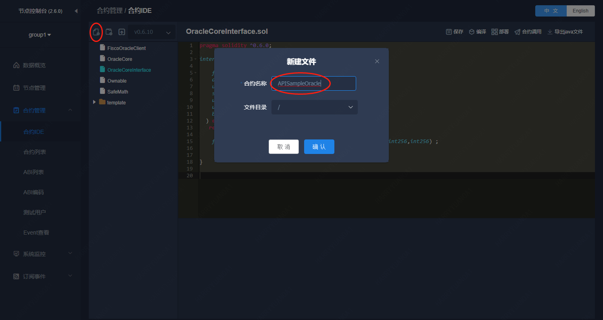

APISampleOracle 合约的代码，请参考：

gitee: [APISampleOracle.sol 合约](https://gitee.com/WeBankBlockchain/Truora-Service/blob/main/contracts/1.0/sol-0.6/oracle/APISampleOracle.sol)  
<br />  
GitHub: [APISampleOracle.sol 合约](https://github.com/WeBankBlockchain/Truora-Service/blob/main/contracts/1.0/sol-0.6/oracle/APISampleOracle.sol)

#### 获取合约地址

在部署 `APISampleOracle` 时，需要获取 `OracleCore` 合约地址，可以通过 Truora-Web 查看。


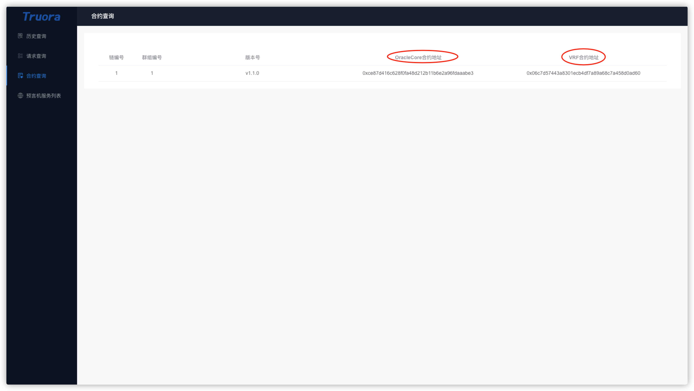

如果需要使用 `RESTful` 接口获取，请参考：[OracleCore 合约地址查询接口](../Truora-Service/interface.html#list_oracle_address)

#### 部署合约

选择 `APISampleOracle` 合约文件，依次点击 **保存** --> **编译** 编译合约。

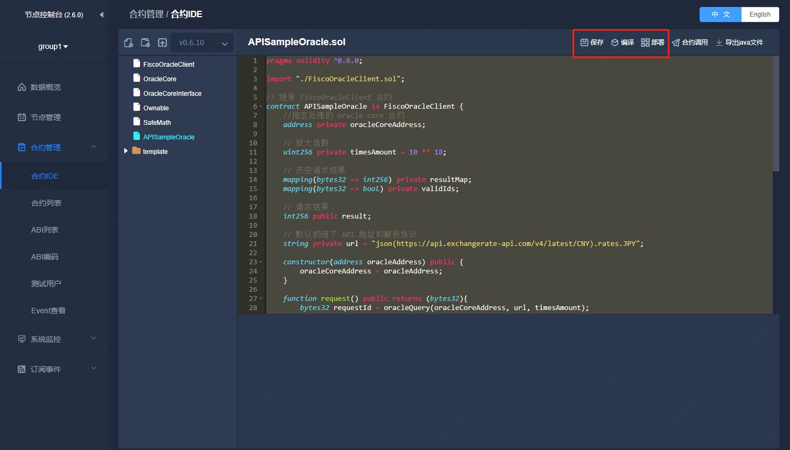

点击 **部署** 按钮，部署 `APISampleOracle` 合约，选择刚刚创建的测试用户 `test`，输入 `OracleCore` 合约地址：

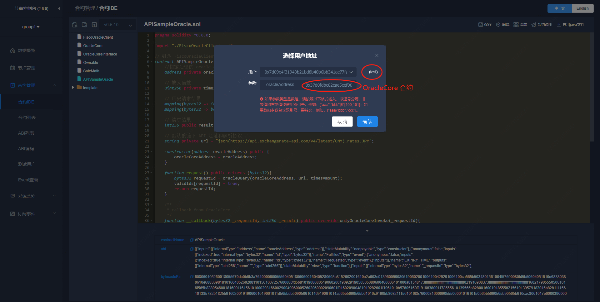


#### 合约调用
调用 `APISampleOracle` 合约的 `request` 方法，触发预言机获取数据


调用 `APISampleOracle` 合约的 `get` 方法，查看预言机返回的结果
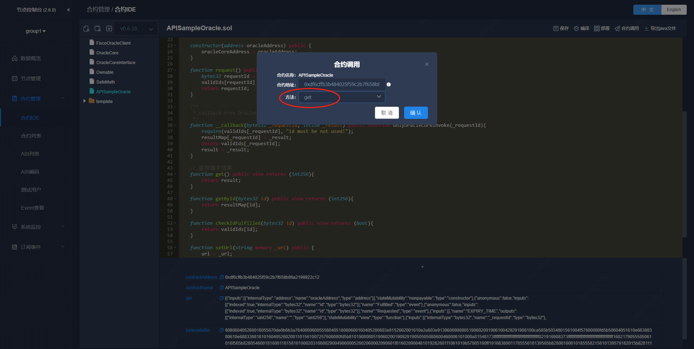

结果显示如下，此处是获取日元到人民币的汇率，放大 `10^18` 倍的结果：

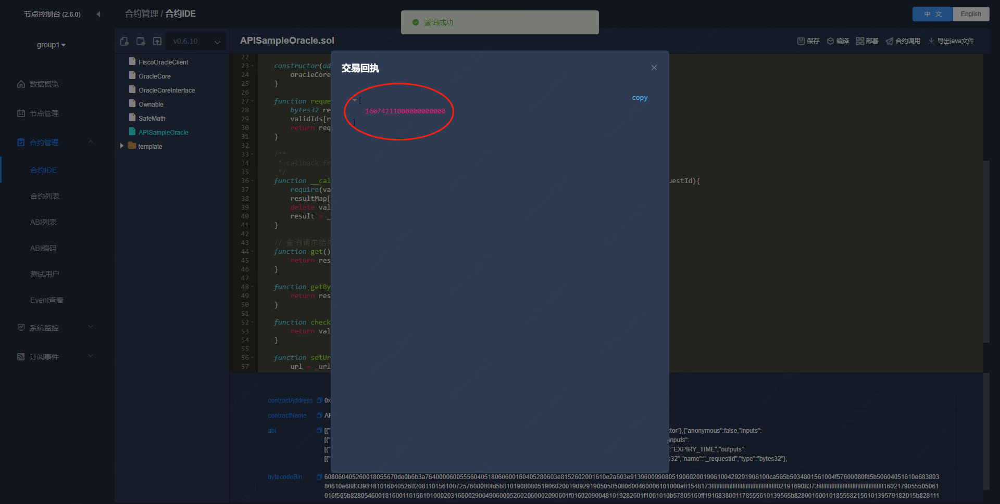


### 获取 VRF 随机数

#### 编写预言机合约
打开一键部署的 WeBASE-Front 页面，默认：`http://{IP}:5002/WeBASE-Front/`，使用部署主机的 IP 地址替换 `{IP}`。

* 点击左边 **合约管理** --> **测试用户**，创建一个调试用户 `test`


* 点击左边 **合约管理** --> **合约 IDE**，选择切换 `solidity` 版本

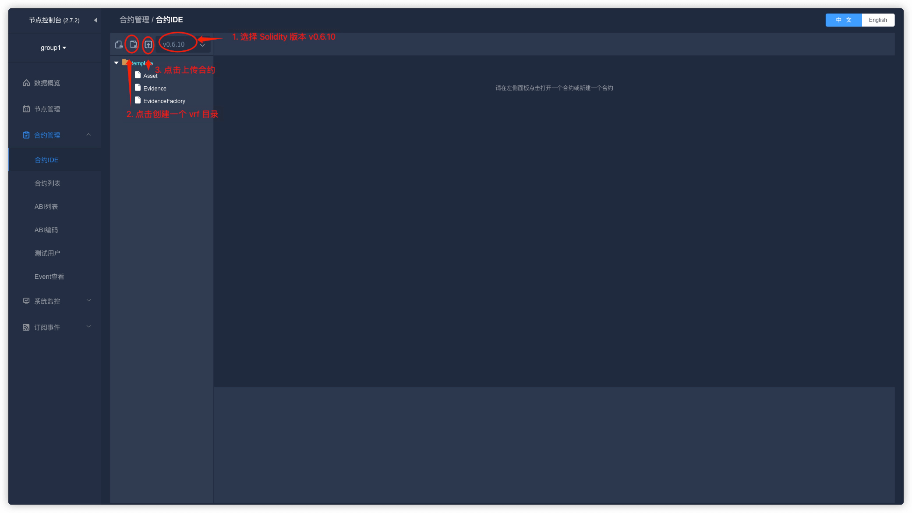

* 创建一个 `vrf` 目录，点击确认

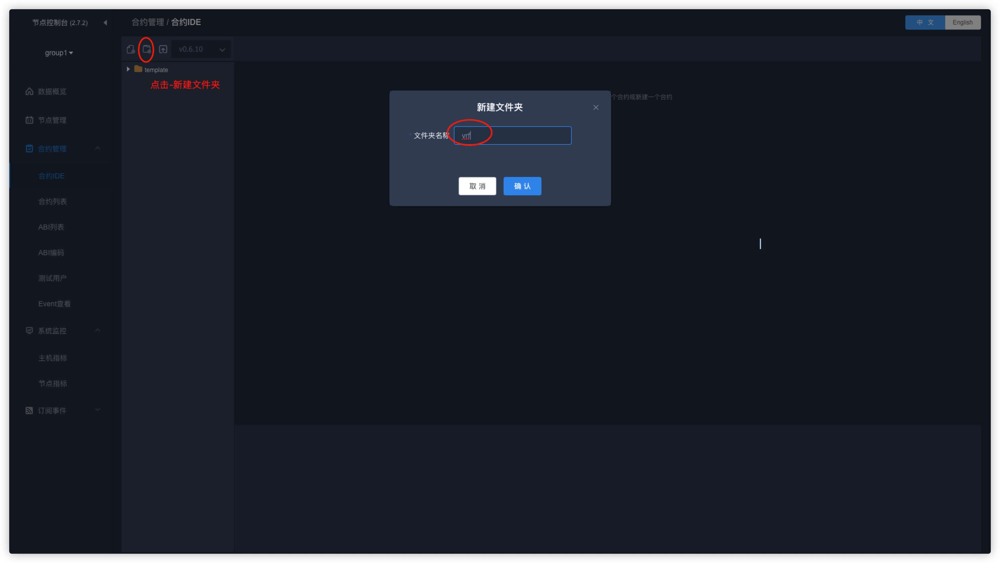

* 上传 VRF 相关合约，包括以下几个合约：

```Bash
EllipticCurve.sol
Ownable.sol
SafeMath.sol
VRF.sol
VRFClient.sol
VRFCore.sol
VRFCoreInterface.sol
VRFUtil.sol
```

gitee 仓库：[VRF 相关合约目录](https://gitee.com/WeBankBlockchain/Truora-Service/tree/main/contracts/1.0/sol-0.6/oracle/simple-vrf)
<br />
GitHub 仓库：[VRF 相关合约目录](https://github.com/WeBankBlockchain/Truora-Service/tree/main/contracts/1.0/sol-0.6/oracle/simple-vrf)


* 确认后，选择上传目录，此处选择根目录 `/vrf`

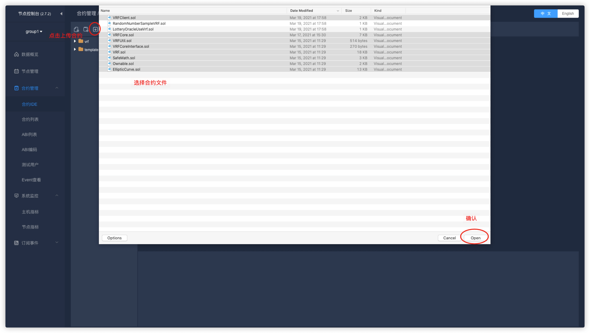


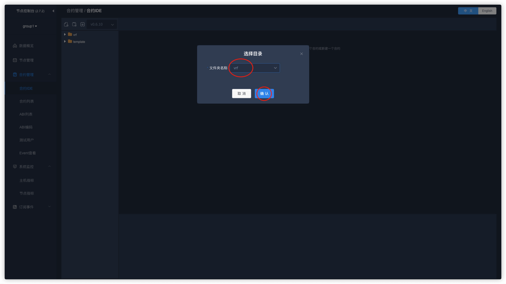

```eval_rst
.. important::

    - 注意需要上传 **八个** 合约文件。
```


* 在 **合约 IDE** 中，创建一个 `RandomNumberSampleVRF` 合约，选中 `vrf` 目录，继承 `VRFClient` 合约，如下

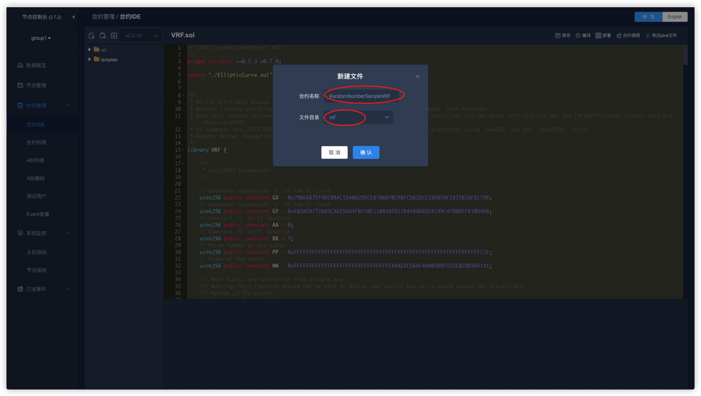


具体代码，请参考：

gitee: [RandomNumberSampleVRF.sol 合约](https://gitee.com/WeBankBlockchain/Truora-Service/blob/main/contracts/1.0/sol-0.6/oracle/simple-vrf/RandomNumberSampleVRF.sol)
<br />
GitHub: [RandomNumberSampleVRF.sol 合约](https://github.com/WeBankBlockchain/Truora-Service/blob/main/contracts/1.0/sol-0.6/oracle/simple-vrf/RandomNumberSampleVRF.sol)

#### 获取合约地址和 _keyHash

* 获取 `VRF` 合约地址

在部署 `RandomNumberSampleVRF` 时，需要获取 `VRF` 合约地址，可以通过 Truora-Web 查看。


如果需要使用 `RESTful` 接口获取，请参考：[VRFCore 合约地址查询接口](../Truora-Service/interface.html#list_oracle_address)

* 获取 `_keyHash`

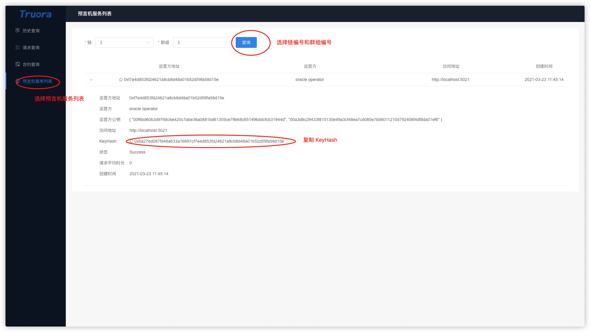


#### 部署合约

选择 `RandomNumberSampleVRF` 合约文件，依次点击 **保存** --> **编译** 编译合约。

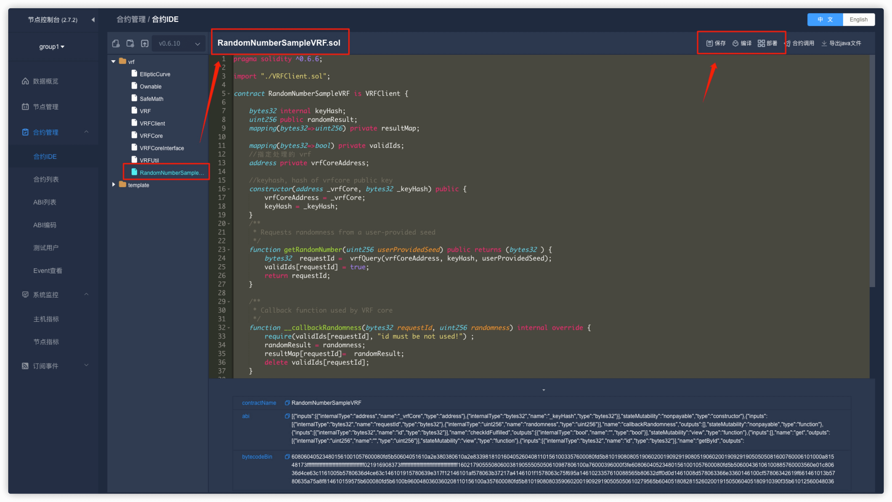


点击 **部署** 按钮，部署 `RandomNumberSampleVRF` 合约，选择刚刚创建的测试用户 `test`，输入 `OracleCore` 合约地址：

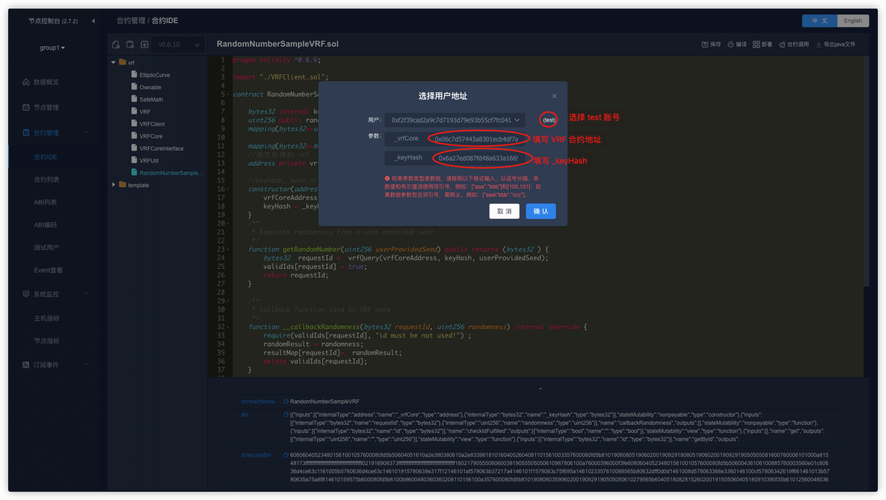


#### 合约调用
调用 `RandomNumberSampleVRF` 合约的 `getRandomNumber` 方法，`userProvidedSeed` 处填写任意一个随机的整型数字即可，点击 **确认** 触发预言机生成随机数

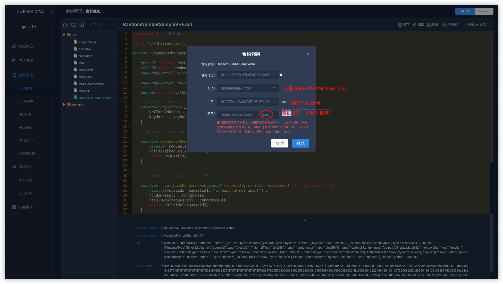


调用 `RandomNumberSampleVRF` 合约的 `get` 方法，查看预言机返回的随机数结果
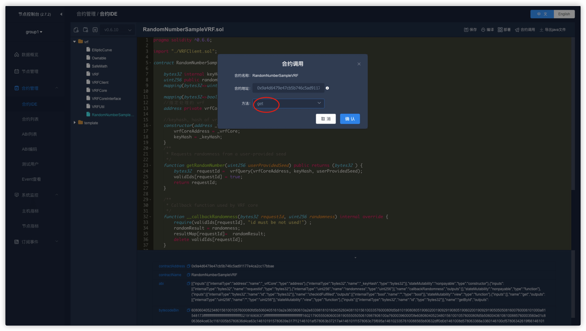

结果显示如下，表示生成的链上随机数结果。

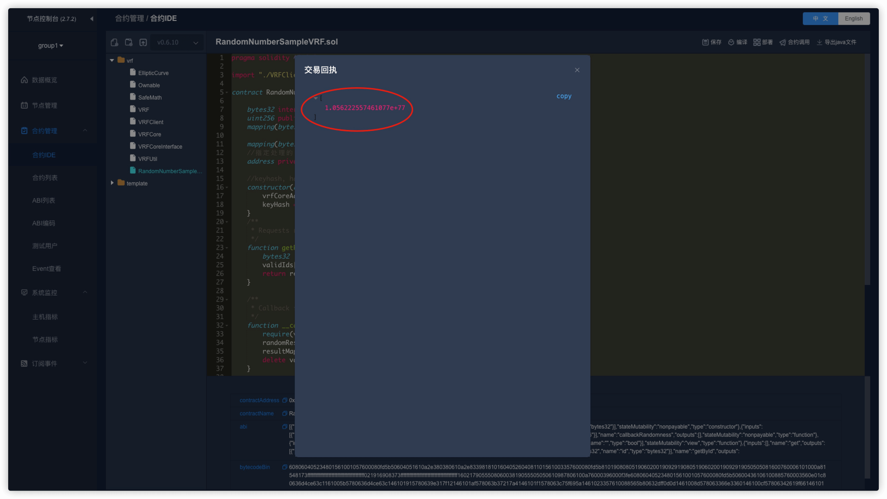


